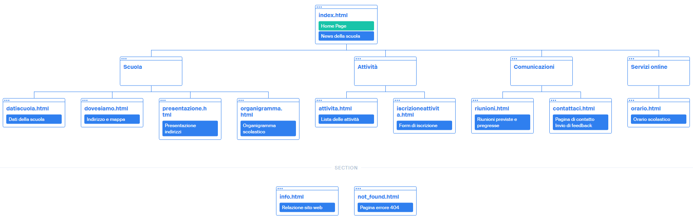

            <a name="inizio">
                <h1>Relazione</h1>
            </a>
        

        <h3>Gruppo A</h3>
        <ul>
            <li>Fazio Alessio</li>
            <li>Forte Marco</li>
            <li>Frontera Leonardo</li>
            <li>Vescio Riccardo</li>
        </ul>

        

        <h2>Traccia</h2>

        

            Vogliamo creare il sito della nostra scuola.
             
            Progettare la struttura partendo dalle seguenti specifiche.
             
            Il pubblico è di utenti occasionali, genitori e studenti che desiderano informazioni sulle attività della scuola.
             
            Ci interessa che gli utenti possano conoscere tempestivamente gli avvisi e che possano inviare comunicazioni e richieste alla scuola.
             
            Dobbiamo quindi prevedere:

            <ul>
                <li>Descrizione dell’organizzazione scolastica</li>
                <li>Un elenco delle attività previste nell’anno</li>
                <li>La possibilità di iscriversi a dette attività</li>
                <li>La possibilità di vedere le riunioni previste e quelle pregresse</li>
            </ul>

            Proporre una soluzione con:

            <ul>
                <li><a href="#analisi">Analisi delle specifiche</a></li>
                <li><a href="#target">Target di utenza</a></li>
                <li><a href="#messaggio">Cosa comunicare/pubblicare</a></li>
                <li><a href="#aree">Aree del sito</a></li>
                <li><a href="#descrizione">Descrizione contenuto / comportamento utente</a></li>
            </ul>

            Definizione della struttura del sito con le varie pagine e i collegamenti, mappa di navigazione e/o casi d’uso, come si intende pubblicare/ aggiornare pubblicizzare il sito.

             

            Realizzazione sito tramite linguaggio HTML, CSS, JavaScript.
        

        

        

            <a href="#inizio" name="analisi">
                <h2>Analisi delle specifiche</h2>
            </a>
    
            

            

        

        

        

            <a href="#inizio" name="target">
                <h2>Target di utenza</h2>
            </a>
    
            

            

        

        

        

            <a href="#inizio" name="messaggio">
                <h2>Cosa comunicare e/o pubblicare</h2>
            </a>
    
            

            

        

        

        

            <a href="#inizio" name="aree">
                <h2>Aree del sito</h2>
            </a>
    
            

                
            

        

        

        

            <a href="#inizio" name="descrizione">
                <h2>Descrizione contenuto / comportamento utente</h2>
            </a>
    
            

            

        

